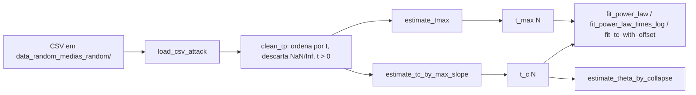

# Estimativa de $t_c(N)$ e $t_{\max}(N)$ — `plots_random_attack_refined.ipynb`

Este documento descreve, passo a passo, como o notebook
[plots_random_attack_refined.ipynb](plots_random_attack_refined.ipynb)
constrói as duas escalas temporais usadas em todo o pipeline de scaling e
colapso:

- $t_c(N)$ — tempo característico de transição (ponto de máxima inclinação da
  curva $p(t)$ em escala log-$t$);
- $t_{\max}(N)$ — maior tempo presente no dado bruto para um par $(N, C)$.

Ambas as quantidades são calculadas no notebook a partir do mesmo arquivo CSV
de entrada e alimentam, em seguida, os ajustes $t_c(N) \sim N^{\theta}$,
$t_c(N) \sim N^{\theta}\log N$, $t_c(N) = t_\infty + a N^{-\theta}$ e o
estimador de colapso.

---

## 1. Pipeline geral



Os dois estimadores ficam na célula que começa em
[plots_random_attack_refined.ipynb](plots_random_attack_refined.ipynb#L61):
`_sg_window`, `estimate_tc_by_max_slope` e `estimate_tmax`.

---

## 2. Pré-processamento: `clean_tp`

Antes de qualquer estimativa, a função `clean_tp` (definida em
[plots_random_attack_refined.ipynb](plots_random_attack_refined.ipynb#L39)):

1. Verifica que as colunas `t` e `p` existem.
2. Converte para `float` via `np.asarray`.
3. Aplica a máscara `np.isfinite(t) & np.isfinite(p) & (t > 0)` para remover
   NaN, Inf e tempos não positivos (necessário porque o estimador de $t_c$
   trabalha em $\log t$).
4. Ordena pelos valores de $t$.

Saída: arrays `(t, p)` limpos e ordenados.

---

## 3. Estimativa de $t_c(N)$ — `estimate_tc_by_max_slope`

### 3.1 Definição matemática

O tempo crítico é definido como o ponto de máxima inclinação de $p$ em
escala log-temporal:

$$
t_c(N) \;=\; \arg\max_{t}\; \frac{dp}{d\ln t}.
$$

Essa escolha (em vez de $dp/dt$) preserva melhor a posição do pico em séries
amostradas de forma logarítmica e é insensível a reescalas multiplicativas
em $t$.

### 3.2 Implementação

```python
def estimate_tc_by_max_slope(df, edge_frac=0.05):
	t, p = clean_tp(df)
	n = len(t)
	if n < 25:
		return np.nan

	logt = np.log(t)
	dp_dlogt = np.gradient(p, logt)

	window = _sg_window(n, frac=0.05, wmin=7, wmax=51)
	if window < n:
		try:
			dp_dlogt = savgol_filter(dp_dlogt, window, polyorder=3)
		except ValueError:
			pass

	k = max(2, int(edge_frac * n))
	interior = slice(k, n - k)

	i_local = int(np.argmax(dp_dlogt[interior]))
	return float(t[interior][i_local])
```

Passos:

1. **Limpeza.** `clean_tp(df)` devolve `(t, p)` finitos, positivos e ordenados.
   Se restarem menos de 25 pontos, retorna `NaN` (não há resolução para
   estimar a derivada com segurança).
2. **Derivada discreta em log-tempo.**
   $\dfrac{dp}{d\ln t}$ é aproximada por `np.gradient(p, logt)` (diferenças
   centradas com correção nas bordas).
3. **Suavização Savitzky–Golay adaptativa.** A janela é definida por
   `_sg_window(n, frac=0.05, wmin=7, wmax=51)`:

   $$
   w \;=\; \text{clip}\!\left(\lfloor 0.05\, n \rfloor,\, 7,\, 51\right),
   $$

   forçada para ímpar. O filtro usa polinômio de grau 3 (`polyorder=3`), o que
   preserva picos melhor que uma média móvel. Se `savgol_filter` falhar
   (janela ≥ `n`), a derivada bruta é usada.
4. **Recorte de borda.** Descarta os `k = max(2, ⌊edge_frac · n⌋)` pontos de
   cada extremo (padrão `edge_frac = 0.05`, ou seja, 5%). Isso evita que
   artefatos numéricos da derivada nas extremidades sejam confundidos com o
   verdadeiro pico.
5. **Localização do pico.** `np.argmax` no intervalo interior devolve o
   índice; $t_c$ é o `t` correspondente.

### 3.3 Parâmetros principais

| Parâmetro    | Padrão | Função                                                  |
|--------------|--------|---------------------------------------------------------|
| `edge_frac`  | `0.05` | Fração descartada em cada borda antes do `argmax`.      |
| `frac` (SG)  | `0.05` | Fração de $n$ usada como janela de suavização.          |
| `wmin / wmax`| `7 / 51` | Limites da janela SG (mantém estabilidade em $N$ pequeno e grande). |
| `polyorder`  | `3`    | Grau do polinômio local do filtro Savitzky–Golay.       |
| `n` mínimo   | `25`   | Abaixo disso retorna `NaN`.                             |

### 3.4 Por que essas escolhas

- **Savitzky–Golay vs média móvel.** Média móvel achata e desloca picos; o
  filtro polinomial local preserva o máximo e sua posição.
- **Janela proporcional a $N$.** Garante que o nível de suavização escale
  com a densidade amostral; os limites `wmin/wmax` evitam suavização
  insuficiente (ruidoso) ou excessiva (pico borrado).
- **Recorte de borda.** `np.gradient` é menos preciso nas extremidades e a
  derivada em log-tempo amplifica erros nos pontos iniciais (onde $\ln t$
  varia muito por passo).

---

## 4. Estimativa de $t_{\max}(N)$ — `estimate_tmax`

```python
def estimate_tmax(df):
	t, _ = clean_tp(df)
	if len(t) == 0:
		return np.nan
	return float(np.max(t))
```

$t_{\max}(N)$ é simplesmente o maior tempo presente no CSV (após `clean_tp`).
Não há suavização nem derivada — é o último ponto observado da série
temporal limpa.

Interpretação física: representa o instante final atingido pela dinâmica de
ataque para um dado $(N, C)$, usado nos ajustes $t_{\max}(N) \sim N^{\alpha}$
e $t_{\max}(N) \sim N^{\theta}\log N$ (compare
[plots_random_attack_refined.ipynb](plots_random_attack_refined.ipynb#L338)).

---

## 5. Como $t_c(N)$ e $t_{\max}(N)$ são consumidos depois

Depois de produzidos os vetores $\{t_c(N)\}$ e $\{t_{\max}(N)\}$ para cada
condição (`C=1`, `C=2`, `C=3`, `C=N`), o notebook executa:

1. **Ajustes lei de potência pura** com `fit_power_law` /
   `fit_power_law_with_error`: $t \sim N^{\theta}$ em log-log com $R^2$ e
   incerteza de $\theta$ via matriz de covariância.
2. **Ajuste com correção logarítmica** `fit_power_law_times_log`:
   $t(N) = A\, N^{\theta}\log N$.
3. **Ajuste com offset** `fit_tc_with_offset`:
   $t_c(N) = t_\infty + a\, N^{-\theta}$ (não linear, `scipy.optimize.curve_fit`).
   Se $t_\infty$ é compatível com zero, o ajuste log-log puro é justificado.
4. **Comparação automática** entre os dois modelos $N^{\theta}$ e
   $N^{\theta}\log N$ pelo $R^2$ — impresso em `print_scalings`.
5. **Colapso de escala** (`estimate_theta_by_collapse` em
   [plots_random_attack_refined.ipynb](plots_random_attack_refined.ipynb#L308)):
   usa $t_c(N)$ como ponto de centragem na variável reescalada
   $x = (t - t_c)\, N^{-\theta}$ e procura $\theta$ que minimiza a variância
   vertical das curvas $p(x)$ na janela crítica $p \in [p_{\min}, p_{\max}]$.

---

## 6. Como o expoente $\theta$ (ou $\alpha$) é estimado

Construídos $\{t_c(N_i)\}$ e $\{t_{\max}(N_i)\}$ para os tamanhos
$N_i \in \{300, 500, 600, 1000, 2000, 3000\}$ (definidos em
[plots_random_attack_refined.ipynb](plots_random_attack_refined.ipynb#L712)),
o notebook ajusta três modelos diferentes a cada série, separadamente para
$C=1$, $C=2$, $C=3$ e $C=N$.

### 6.1 Modelo 1 — lei de potência pura: `fit_power_law`

Modelo:

$$
t(N) \;=\; A\, N^{\theta}
\quad\Longleftrightarrow\quad
\log t \;=\; \log A + \theta\,\log N.
$$

Implementação em
[plots_random_attack_refined.ipynb](plots_random_attack_refined.ipynb#L106):

```python
def fit_power_law(x, y):
	mask = np.isfinite(x) & np.isfinite(y) & (x > 0) & (y > 0)
	x, y = x[mask], y[mask]
	logx, logy = np.log(x), np.log(y)
	alpha, intercept = np.polyfit(logx, logy, 1)
	logy_hat = alpha * logx + intercept
	ss_res = np.sum((logy - logy_hat) ** 2)
	ss_tot = np.sum((logy - np.mean(logy)) ** 2)
	r2 = 1.0 - ss_res / ss_tot if ss_tot > 0 else np.nan
	return alpha, intercept, r2
```

Mecânica:

1. Filtra pares com $x>0,\,y>0$.
2. Ajuste linear de mínimos quadrados em $(\log N,\, \log t)$ via
   `np.polyfit(..., deg=1)`. O coeficiente angular é $\theta$ (ou $\alpha$
   no caso de $t_{\max}$); o coeficiente linear é $\log A$.
3. Calcula $R^2$ no espaço log-log:
   $R^2 = 1 - \mathrm{SS}_{\text{res}}/\mathrm{SS}_{\text{tot}}$.

A versão `fit_power_law_with_error` faz o mesmo ajuste com
`np.polyfit(..., cov=True)` e devolve $\sigma_\theta = \sqrt{\mathrm{cov}_{00}}$
como incerteza do expoente.

### 6.2 Modelo 2 — correção logarítmica: `fit_power_law_times_log`

Modelo:

$$
t(N) \;=\; A\, N^{\theta}\,\log N.
$$

Tomando logaritmo dos dois lados:

$$
\log t \;=\; \log A \;+\; \theta\,\log N \;+\; \log(\log N).
$$

A função reduz a variável dependente subtraindo $\log(\log N)$ e ajusta uma
reta:

```python
y_reduced = logy - log_power * np.log(np.log(x))
theta, intercept = np.polyfit(np.log(x), y_reduced, 1)
```

O $R^2$ é computado **no espaço $\log t$ original** (somando de volta o
termo $\log\log N$ na predição), de forma que ele é comparável ao $R^2$ do
modelo 1.

### 6.3 Modelo 3 — offset: `fit_tc_with_offset`

Modelo não linear (somente para $t_c$, não para $t_{\max}$):

$$
t_c(N) \;=\; t_\infty \;+\; a\, N^{-\theta}.
$$

Implementação em
[plots_random_attack_refined.ipynb](plots_random_attack_refined.ipynb#L207)
(via `scipy.optimize.curve_fit`):

```python
def model(N, t_inf, a, theta):
	return t_inf + a * N ** (-theta)

alpha, intercept, _ = fit_power_law(Ns, tcs)         # chute inicial
p0 = [np.min(tcs) * 0.5, np.exp(intercept), -alpha]
popt, _ = curve_fit(model, Ns, tcs, p0=p0, maxfev=20000)
```

Saída: `{"t_inf", "a", "theta", "r2"}`. Interpretação: se `t_inf ≈ 0`, o
modelo log-log puro é justificado; se `t_inf` é claramente positivo, há um
limite assintótico finito quando $N \to \infty$ (a transição não é
estritamente crítica).

### 6.4 Comparação automática (impressa em `print_scalings`)

Em [plots_random_attack_refined.ipynb](plots_random_attack_refined.ipynb#L342),
os modelos 1 e 2 são ajustados às mesmas séries e o que tiver maior $R^2$ é
declarado vencedor:

```
Comparação (R² maior favorece o modelo):
C=1: R²_puro=0.999, R²_log=0.998 -> favorece N^theta
...
```

O mesmo é feito separadamente para $t_c$ e para $t_{\max}$.

### 6.5 Caso $C=N$ — expoentes distintos $\theta_\ominus$ e $\theta_\oplus$

A função `estimate_article_exponents` (em
[plots_random_attack_refined.ipynb](plots_random_attack_refined.ipynb#L240))
trata o caso $C=N$ de modo especial, refletindo a teoria do artigo:

| Quantidade   | Modelo aplicado                | Expoente extraído              |
|--------------|--------------------------------|--------------------------------|
| $t_c(N)$     | $t_c \sim N^{\theta_\ominus}$  | `theta_minus` (lei pura)       |
| $t_{\max}(N)$| $t_{\max} \sim N^{\theta_\oplus}\log N$ | `theta_plus` (com correção log) |

Para $C \in \{1,2,3\}$ usa-se `theta_tc` (lei de potência em $t_c$) e
`theta_tmax` (lei com correção log em $t_{\max}$); ambos com erro
calculado pela matriz de covariância de `polyfit`.

### 6.6 Diagnóstico complementar para $t_{\max}$ — `test_tmax_scaling`

Para checar a hipótese $t_{\max} \propto N^{2}$ existe a rotina
`test_tmax_scaling` (em
[plots_random_attack_refined.ipynb](plots_random_attack_refined.ipynb#L646)):

1. **Ajuste direto** $t_{\max} \sim N^{\alpha}$ por `fit_power_law` e
   imprime $\alpha$ e $R^2$.
2. **Razão $t_{\max}/N^2$.** Tabela com $a_i = t_{\max}(N_i)/N_i^2$. Se a
   teoria prevê $\alpha=2$, esses valores devem ser aproximadamente
   constantes.
3. **Busca por minimização da variância log.** Faz uma varredura
   $\alpha \in [1.8, 2.4]$ com 500 pontos e escolhe

   $$
   \alpha^{*} \;=\; \arg\min_{\alpha} \;\mathrm{Var}\!\left[\log\!\left(t_{\max}/N^{\alpha}\right)\right].
   $$

   Critério de invariância de escala: o melhor expoente é o que torna a
   sequência $t_{\max}(N)/N^{\alpha}$ a mais constante possível.
4. **Plots:** $t_{\max}/N^2$ vs $N$ e $\mathrm{Var}[\log(t_{\max}/N^\alpha)]$
   vs $\alpha$, com linha vermelha em $\alpha^{*}$.

### 6.7 Razão $t_c/t_{\max}$ — `plot_tc_over_tmax`

Em [plots_random_attack_refined.ipynb](plots_random_attack_refined.ipynb#L597),
ajusta $t_c/t_{\max} \sim N^{\beta}$ por `fit_power_law` para cada $C$. Se
$t_c \sim N^{\theta}$ e $t_{\max} \sim N^{\alpha}$, o expoente da razão
$\beta$ é uma checagem direta de $\theta - \alpha$.

### 6.8 Plot de scaling (painel (a) e (b)) — `plot_scaling_tc_tmax`

[plots_random_attack_refined.ipynb](plots_random_attack_refined.ipynb#L473)
gera um painel com:

- **(a)** $t_c$ vs $N$ em log-log, com pontos para cada $C$ e duas
  linhas tracejadas: lei pura $N^{\theta}$ (`--`) e lei com correção
  $N^{\theta}\log N$ (`:`).
- **(b)** o mesmo para $t_{\max}$, com $N^{\alpha}$ e $N^{\theta}\log N$.

As linhas são produzidas amostrando `Nfit = np.logspace(log10(Nmin),
log10(Nmax), 300)` e calculando

$$
t_{\text{fit}}(N) = e^{b}\, N^{\theta}, \qquad
t_{\text{fit}}^{\log}(N) = e^{b_{\log}}\, N^{\theta_{\log}}\,\log N,
$$

onde $b$ e $b_{\log}$ são os interceptos retornados por `fit_power_law` e
`fit_power_law_times_log`, respectivamente.

---

## 7. Data collapse — como o código encontra $\theta$ pelo colapso

A ideia do *data collapse* é: se a curva $p(t, N)$ tem invariância de escala
em torno do ponto crítico, então existe um expoente $\theta$ tal que todas
as curvas, para diferentes $N$, ficam superpostas quando são reescritas em
função da variável reescalada (mesma escala para todo $N$)

$$
x \;=\; (t - t_c(N))\, N^{-\theta}
\qquad\text{(centrado)},
$$

ou, na versão usada nos painéis de figura,

$$
x \;=\; t\, N^{-\theta}
\qquad\text{(não centrado)}.
$$

O notebook implementa **as duas variantes** em funções distintas: a primeira
serve para estimar numericamente o melhor $\theta$; a segunda serve para
visualizar o colapso.

### 7.1 Score de colapso — `collapse_score_physical`

Definido em
[plots_random_attack_refined.ipynb](plots_random_attack_refined.ipynb#L265),
mede o quão bem um dado $\theta$ colapsa as curvas:

```python
def collapse_score_physical(
	dfs, Ns, tcs, theta,
	masks=None, pmin=0.05, pmax=0.9, ngrid=400,
	drop_worst=True,
):
	curves = []
	for i, (df, N, tc) in enumerate(zip(dfs, Ns, tcs)):
		t, p = clean_tp(df)
		m = masks[i] if masks is not None else ((p >= pmin) & (p <= pmax))
		t, p = t[m], p[m]
		x = (t - tc) * (N ** (-theta))
		idx = np.argsort(x)
		curves.append((x[idx], p[idx]))

	left = max(c[0][0]  for c in curves)
	right = min(c[0][-1] for c in curves)
	grid = np.linspace(left, right, ngrid)
	P = np.vstack([np.interp(grid, x, p) for x, p in curves])

	mean_curve = np.mean(P, axis=0)
	dPdx = np.gradient(mean_curve, grid)
	weight = np.abs(dPdx) + 1e-7

	if drop_worst and P.shape[0] >= 4:
		dev = np.average((P - mean_curve) ** 2, axis=1, weights=weight)
		keep = np.ones(P.shape[0], dtype=bool)
		keep[int(np.argmax(dev))] = False
		P = P[keep]
		mean_curve = np.mean(P, axis=0)

	score = np.average(np.var(P, axis=0), weights=weight)
	return float(score)
```

Passos:

1. **Janela crítica.** Para cada $N$, mantém apenas pontos com
   $p \in [p_{\min}, p_{\max}] = [0.05, 0.9]$. Isso elimina os patamares
   inicial ($p \approx 0$) e final ($p \to 1$) onde todas as curvas são
   triviais e poderiam mascarar o colapso.
2. **Mudança de variável.** Calcula
   $x_i = (t_i - t_c(N))\, N^{-\theta}$ e ordena por $x$.
3. **Grade comum (reamostragem para alinhar as curvas).**

   Depois da mudança de variável, cada $N$ tem o seu próprio vetor
   $x = (t - t_c)\,N^{-\theta}$, e esses vetores **não coincidem**: cada
   curva foi medida em tempos diferentes e o reescalonamento por
   $N^{-\theta}$ os comprime/estende de jeitos diferentes. Para comparar
   curva com curva ponto a ponto (necessário para calcular variância
   vertical), o código precisa primeiro pô-las todas na mesma régua em
   $x$. Isso é feito em três sub-passos:

   1. **Intervalo de sobreposição.** Para cada curva $i$ pega o menor
      ($x_{\min}^{(i)}$) e o maior ($x_{\max}^{(i)}$) valor de $x$.
      Define-se

      $$
      \text{left}  = \max_i x_{\min}^{(i)}, \qquad
      \text{right} = \min_i x_{\max}^{(i)}.
      $$

      É o maior intervalo em que **todas** as curvas têm dados
      simultaneamente — fora dele, alguma curva exigiria extrapolação,
      que distorceria o score.

   2. **Régua uniforme.** Cria
      `grid = np.linspace(left, right, 400)`: um vetor com 400 valores
      de $x$ igualmente espaçados, igual para todo $N$. Esses 400 valores
      serão as colunas da matriz `P` no passo seguinte.

   3. **Interpolação linear.** O valor de $p$ **já existe**, mas só nos
      valores de $x$ originais da curva (os que vieram do CSV depois da
      mudança de variável). Os 400 pontos da grade quase nunca caem em
      cima desses valores — eles ficam *entre* os pontos medidos. Para
      ter $p$ exatamente nos pontos da grade, o código estima cada um
      desses valores intermediários traçando uma reta entre o ponto
      medido logo à esquerda e o logo à direita e lendo o $p$ dessa reta
      no $x$ desejado. Isso é o que `np.interp(grid, x, p)` faz:

      $$
      p(x_{\text{grid}}) \;=\; p(x_k) + \frac{p(x_{k+1}) - p(x_k)}{x_{k+1} - x_k}\,(x_{\text{grid}} - x_k),
      $$

      onde $x_k \le x_{\text{grid}} < x_{k+1}$ são os dois pontos
      medidos que cercam $x_{\text{grid}}$. Nenhum dado é inventado —
      apenas se lê o valor "entre" dois pontos vizinhos.

      Exemplo numérico: se a curva medida tem $p(0.30) = 0.40$ e
      $p(0.50) = 0.60$ e o ponto da grade é $x = 0.40$, a interpolação
      devolve $p(0.40) = 0.50$ (meio do caminho).

      As curvas viram então linhas da matriz

      $$
      P \in \mathbb{R}^{N_{\text{curvas}} \times 400},
      $$

      ou seja: `P[i, j]` é o valor de $p$ da curva $i$ no $j$-ésimo ponto
      da grade.

   Visualmente:

   ```
   Antes (cada N tem seu eixo x próprio):
	 N=300 :  x300 = [0.21, 0.34, 0.58, ...]   p300 = [...]
	 N=500 :  x500 = [0.19, 0.40, 0.61, ...]   p500 = [...]
	 N=1000:  x1k  = [0.17, 0.31, 0.55, ...]   p1k  = [...]

   Depois (mesma régua para todos):
	 grid  = [left, ...   400 pontos uniformes ...  , right]
	 P[0]  = p300 interpolado em grid
	 P[1]  = p500 interpolado em grid
	 P[2]  = p1k  interpolado em grid
   ```

   Com `P` no formato fixo (linhas = curvas, uma por $N$; colunas = os
   400 pontos da grade em $x$), o código mede o quanto as curvas
   discordam entre si **em cada $x$ da grade**, comparando os valores de
   $p$ ao longo da **coluna** correspondente de `P`.

   - **Por que "vertical".** Imagine o gráfico com $x$ no eixo horizontal
     e $p$ no eixo vertical. Em um $x$ fixo (uma coluna de `P`) há vários
     pontos empilhados — um para cada $N$. A variância vertical é
     literalmente o quanto esses pontos estão espalhados na direção do
     eixo $p$. Colapso perfeito ⇒ todos no mesmo lugar ⇒ variância zero.
     Colapso ruim ⇒ pontos espalhados ⇒ variância alta.

   - **O que `np.var(P, axis=0)` faz.** `axis=0` significa "reduzir ao
     longo das linhas", ou seja, para cada coluna $j$ calcular a
     variância dos valores empilhados:

     $$
     v(x_j) \;=\; \frac{1}{N_{\text{curvas}}}\sum_{i=1}^{N_{\text{curvas}}}
       \bigl(P[i, j] - \bar p(x_j)\bigr)^2,
     \qquad
     \bar p(x_j) \;=\; \frac{1}{N_{\text{curvas}}}\sum_i P[i, j].
     $$

     O resultado é um vetor de tamanho 400 — um número de "espalhamento"
     por ponto da grade.

   - **Exemplo concreto.** Em uma coluna $j$ qualquer:

     ```
     P[:, j] = [0.42, 0.40, 0.41, 0.43]   (4 curvas, 4 valores de N)
     mean    = 0.415
     var     = 0.000125    -> colapso bom nesse ponto
     ```

     Já em outro $\theta$ que separa as curvas:

     ```
     P[:, j] = [0.30, 0.40, 0.50, 0.60]
     mean    = 0.45
     var     = 0.0125      -> 100x pior nesse ponto
     ```

   - **Como vira o score.** Ainda no passo 6, o vetor $v(x_j)$ é
     combinado com o peso $w(x_j)$ (que valoriza a janela crítica) numa
     média ponderada:

     $$
     S(\theta) \;=\; \frac{\sum_j w(x_j)\, v(x_j)}{\sum_j w(x_j)}.
     $$

     Esse $S(\theta)$ é o número que `estimate_theta_by_collapse` tenta
     **minimizar**. Logo: menor variância vertical ⇒ curvas mais
     superpostas ⇒ $\theta$ mais próximo do verdadeiro expoente do
     colapso.

4. **Peso $w(x)$ — onde a métrica "presta atenção".**

   Notação: $p$ é a quantidade plotada no eixo vertical do colapso (no
   código é a coluna `p` do CSV, ou seja, a probabilidade/fração que está
   sendo estudada como função de $t$ e $N$). Depois do passo 3 temos uma
   matriz $P$ em que cada linha é uma curva $p(x)$ — uma para cada $N$ —
   reamostrada nos mesmos 400 valores de $x$ da grade.

   A partir de $P$ o código constrói duas coisas:

   1. **Curva média** sobre os $N$, em cada ponto $x_j$ da grade:

	  $$
	  \bar p(x_j) \;=\; \frac{1}{N_{\text{curvas}}}\sum_{i=1}^{N_{\text{curvas}}} P[i, j].
	  $$

	  Em código: `mean_curve = np.mean(P, axis=0)`. É um vetor de 400
	  valores que representa o "perfil típico" de $p$ ao longo de $x$.

   2. **Derivada da curva média** em relação a $x$, em módulo:

	  $$
	  w(x_j) \;=\; \left|\frac{d\bar p}{dx}\right|_{x_j} \;+\; \varepsilon,
	  \qquad \varepsilon = 10^{-7}.
	  $$

	  Em código: `dPdx = np.gradient(mean_curve, grid)` e
	  `weight = np.abs(dPdx) + 1e-7`. O $\varepsilon$ existe só para
	  evitar peso exatamente zero (que quebraria a média ponderada).

   **Por que usar essa derivada como peso?** A curva $p(x)$ é quase plana
   nos extremos: vale algo próximo de 0 antes da transição e algo próximo
   de 1 (ou do platô) depois. Nessas regiões, $|d\bar p/dx| \approx 0$,
   então $w \approx 0$ e os pontos quase não contribuem para o score. Já
   no meio da transição $\bar p$ varia rápido com $x$, $|d\bar p/dx|$ é
   grande e $w$ também — esses pontos pesam muito.

   O efeito prático é que o score do colapso é dominado pela **janela
   crítica** (onde as curvas de fato sobem). Sem o peso, os patamares
   horizontais nas pontas — que coincidem trivialmente para qualquer
   $\theta$ — dominariam a média e o $\theta$ ótimo ficaria mal definido.
5. **Descarte da pior curva** (`drop_worst=True`). Se houver $\ge 4$
   curvas, identifica aquela com maior desvio ponderado e a remove. Isso
   evita que um único $N$ ruidoso (tipicamente o menor) domine o score.
6. **Score.** Variância vertical das curvas remanescentes, ponderada pelo
   mesmo $w(x)$:

   $$
   S(\theta) \;=\; \frac{\sum_x w(x)\, \mathrm{Var}_N[P(x, N)]}{\sum_x w(x)}.
   $$

   Quanto menor, melhor o colapso.

### 7.2 Busca de $\theta$ — `estimate_theta_by_collapse`

Em
[plots_random_attack_refined.ipynb](plots_random_attack_refined.ipynb#L313),
a busca é em **duas passadas** (coarse + refine) para evitar escolher um
mínimo local de granulação grosseira:

```python
def estimate_theta_by_collapse(
	dfs, Ns, tcs,
	theta_min=0.0, theta_max=6.0,
	coarse_points=300, refine_points=300,
	pmin=0.05, pmax=0.9,
):
	# 1) varredura grosseira
	grid1 = np.linspace(theta_min, theta_max, coarse_points)
	scores1 = np.array([score(th) for th in grid1])
	theta1 = grid1[np.argmin(scores1)]

	# 2) zoom em ±3 passos em torno do melhor
	step = (theta_max - theta_min) / (coarse_points - 1)
	left = max(theta_min, theta1 - 3 * step)
	right = min(theta_max, theta1 + 3 * step)

	grid2 = np.linspace(left, right, refine_points)
	scores2 = np.array([score(th) for th in grid2])
	return float(grid2[np.argmin(scores2)])
```

1. **Varredura grossa.** Avalia $S(\theta)$ em 300 valores uniformemente
   espaçados em $[0, 6]$ e localiza o melhor $\theta_1$.
2. **Refinamento local.** Faz nova varredura de 300 pontos numa janela
   $\pm 3 \cdot \Delta\theta_{\text{coarse}}$ em torno de $\theta_1$. O
   retorno é o $\theta$ que minimiza $S$ na grade fina.

Esta função usa os $t_c(N)$ previamente estimados como pontos de
centragem; ela **não** reestima $t_c$ — assume que `estimate_tc_by_max_slope`
já produziu uma centragem boa.

### 7.3 Plot de colapso — `plot_collapse_panel_article`

Em
[plots_random_attack_refined.ipynb](plots_random_attack_refined.ipynb#L569),
a visualização usa a forma **não centrada**:

```python
def plot_collapse_panel_article(ax, dfs, Ns, theta, styles, title):
	for df, N, st in zip(dfs, Ns, styles):
		t, p = clean_tp(df)
		x = t * N ** (-theta)
		idx = np.argsort(x)
		ax.plot(x[idx], p[idx], **st)
	ax.set_xscale("log")
	ax.set_xlabel(r"$tN^{-\theta}$")
	ax.set_ylabel(r"$p$")
```

Aqui não há subtração de $t_c$; cada curva é simplesmente reescalada por
$N^{-\theta}$ e plotada em eixo $x$ logarítmico. Se o $\theta$ vier dos
ajustes log-log de $t_c(N)$ (e a teoria for correta), as curvas devem se
superpor.

### 7.4 Colapso por partes para $C=N$ — `plot_collapse_panel_piecewise_cn`

O caso $C=N$ tem dois expoentes distintos ($\theta_\ominus$ antes do pico,
$\theta_\oplus$ depois). A função
[plots_random_attack_refined.ipynb](plots_random_attack_refined.ipynb#L585)
aplica reescalas diferentes em cada lado de $t_c$:

```python
x = np.empty_like(t, dtype=float)
left = t <= tc
x[left]  = t[left]  * N ** (-theta_minus)
x[~left] = t[~left] * N ** (-theta_plus)
```

Os pontos $t \le t_c$ são reescalados por $N^{-\theta_\ominus}$ e os
$t > t_c$ por $N^{-\theta_\oplus}$, produzindo um único colapso *piecewise*
em torno do ponto crítico — exatamente a construção descrita no artigo de
referência.

### 7.5 Como tudo se encaixa no `plot_final`

[plots_random_attack_refined.ipynb](plots_random_attack_refined.ipynb#L711)
encadeia tudo:

1. `plot_scaling_tc_tmax` → produz $\{t_c(N)\}$, $\{t_{\max}(N)\}$ e os
   ajustes log-log.
2. `estimate_article_exponents` → devolve $\theta$ (por $C$), $\theta_\ominus$
   e $\theta_\oplus$ (para $C=N$).
3. `plot_collapse_panel_article` é chamada para $C=1, 2, 3$ com o $\theta$
   correspondente; `plot_collapse_panel_piecewise_cn` é chamada para $C=N$
   com $(\theta_\ominus, \theta_\oplus)$.
4. O grid 2×2 resultante é salvo como `collapse_article_line.png`.

> Observação: `estimate_theta_by_collapse` está implementada e disponível,
> mas no fluxo padrão de `plot_final` o $\theta$ usado no colapso vem dos
> ajustes log-log de $t_c$ (e $t_{\max}/\log N$ para $\theta_\oplus$).
> Para usar o $\theta$ que minimiza diretamente o score do colapso, chame
> `estimate_theta_by_collapse(dfs, Ns, tcs)` e passe o resultado às
> funções de plot.

---

## 8. Resumo

| Quantidade  | Definição operacional                                                                 | Função no notebook              |
|-------------|----------------------------------------------------------------------------------------|---------------------------------|
| $t_c(N)$    | $\arg\max_t dp/d\ln t$ com derivada suavizada (Savitzky–Golay) e bordas recortadas.    | `estimate_tc_by_max_slope`      |
| $t_{\max}(N)$ | $\max\{t : (t,p) \in \text{série limpa}\}$.                                          | `estimate_tmax`                 |
| $\theta$ (colapso) | $\arg\min_\theta \mathrm{Var}_N[p((t-t_c)N^{-\theta})]$ ponderada por $|d\bar p/dx|$. | `collapse_score_physical` + `estimate_theta_by_collapse` |

Ambas dependem unicamente das colunas `t` e `p` do CSV; os parâmetros de
suavização (`frac=0.05`, `wmin=7`, `wmax=51`, `polyorder=3`) e recorte
(`edge_frac=0.05`) são fixos no código mas explícitos no cabeçalho das
funções, podendo ser ajustados sem afetar o restante do pipeline.
